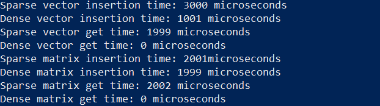

# Лабораторная работа №4
### Задание
В том случае, когда подавляюще большое количество элементов вектора или
матрицы равны нулям для их хранения имеет смысл использовать структуры
данных, позволяющие существенно экономить память, за счёт того, что нули
можно не хранить.
Задание: разработать шаблонные классы для хранения разреженных вектора
и 2D матрицы для чего:

 - Предложить структуры данных для хранения значений исходных
векторов и матриц. (подсказка: использование хеш-таблиц —
хорошая идея), рассмотрите необходимость поддержки
собственных итераторов;
 - Реализовать набор унарных и бинарных операций для вектора и
матриц; (транспонирование, сложение, произведение векторов
(вспоминаем линейную алгебру), обращение матрицы,
возведение матрицы в степень — предусмотреть два варианта с
целочисленным и вещественным показателем, подумать на тему
относительно того, как решить вопрос с возведением в степень —
т. е. в степень можно возводить только квадратные матрицы, но
не создавать же отдельный класс для квадратных и для
прямоугольных матриц, или создавать?), произведение вектора и
матрицы.
 - Реализовать поэлементные операции для элементов векторов и
матриц — арифметические операции со скалярной величиной,
поэлементное возведение в степень.
 - Провести сравнение скоростей обработки предложенного вами
способа хранения и обработки разреженных матриц и
выполнение тех же действий над векторами и матрицами,
хранящимся с помощью стандартного контейнера vector.
 - Результаты работы оформить в виде отчета или файла readme
если код будет на Git.

### Решение

Для хранения разреженных векторов и матриц были использованы стандартные
контейнеры std::map и std::pair. Это позволяет эффективно хранить только ненулевые
элементы, что экономит память.

Для плотных векторов и матриц были использованы стандартные контейнеры
std::vector.

Вставка, получение и вывод элементов осуществляются с помощью
методов классов SparseVector, SparseMatrix, DenseVector и DenseMatrix.
Для сравнения скоростей использовались функции measure_time, которые измеряют
время выполнения операций вставки и доступа к элементам. В данном примере
сравнивались разреженные и плотные векторы и матрицы.

### SparseVector
- Хранит только ненулевые элементы с помощью `std::map`, где пары представляют `(индекс, значение)`.
- **Методы**:
    - `insert`: Добавляет или удаляет элементы в зависимости от того, равно ли значение нулю.
    - `get`: Возвращает значение; по умолчанию — `0`, если индекс не найден.
    - `print`: Выводит ненулевые элементы.

### DenseVector
- Использует `std::vector` для хранения всех элементов, включая нули.
- **Методы**:
    - `insert`: Изменяет размер вектора при необходимости и записывает значение.
    - `get`: Возвращает значение по индексу или `0`, если индекс выходит за границы.
    - `print`: Выводит все элементы, включая нули.

### SparseMatrix
- Использует `std::map` с парами `((строка, столбец), значение)` для хранения только ненулевых значений.
- **Методы**:
    - `insert`: Добавляет или удаляет записи в зависимости от того, равно ли значение нулю.
    - `get`: Возвращает значение по заданным строке и столбцу; по умолчанию — `0`, если пара не найдена.
    - `print`: Выводит все ненулевые элементы.

### DenseMatrix
- Использует `std::vector<std::vector<double>>` для полного представления матрицы, включая нули.
- **Методы**:
    - `insert`: Изменяет размер строк и столбцов при необходимости и записывает значение.
    - `get`: Возвращает значение по строке и столбцу или `0`, если индекс выходит за границы.
    - `print`: Выводит все элементы, включая нули.

---

### Результат измерения времени
